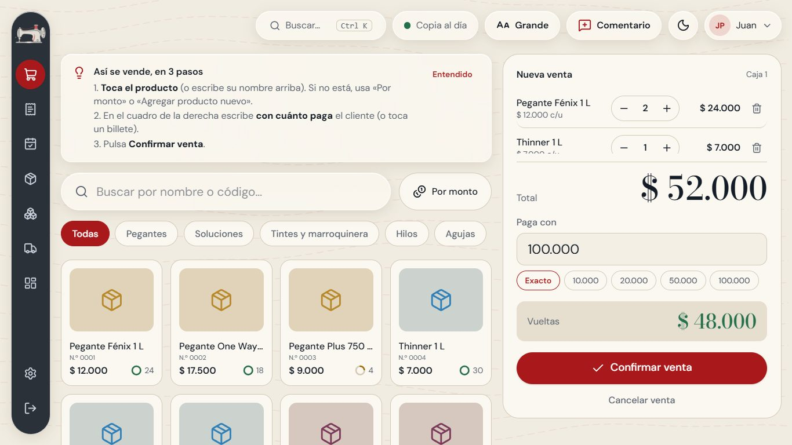
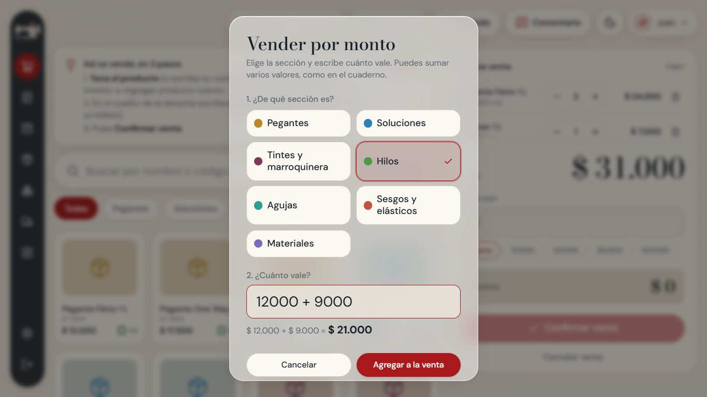
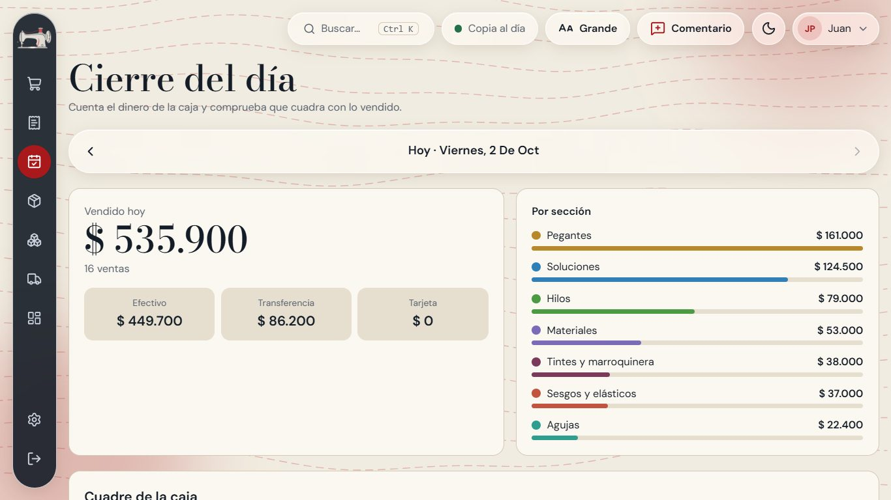
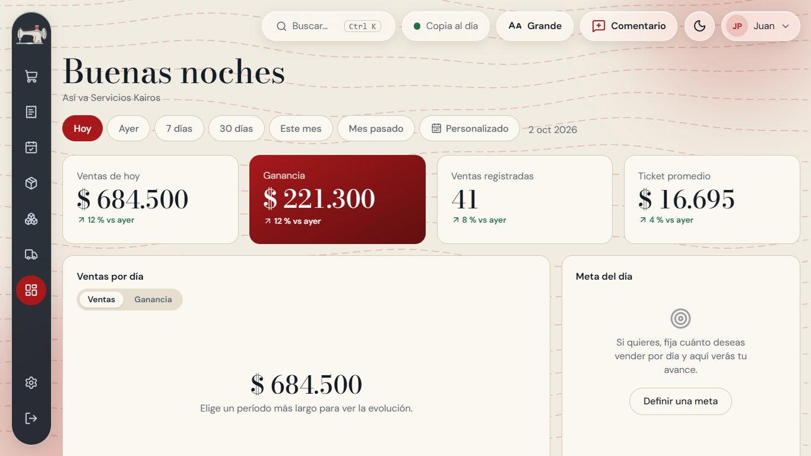
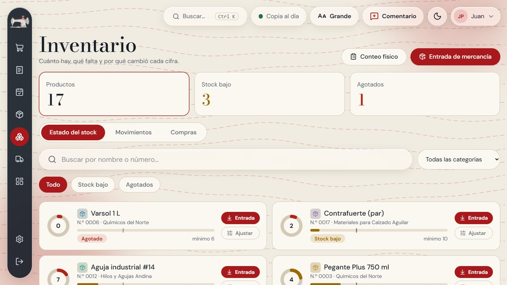
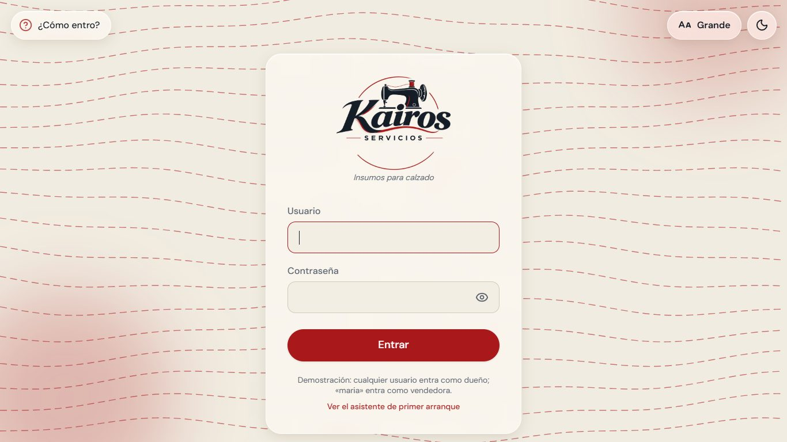
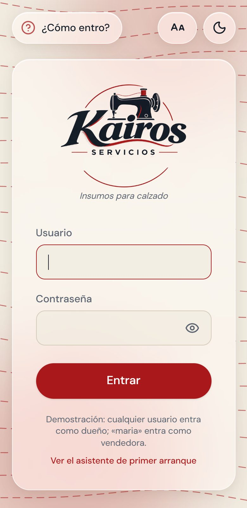

# Servicios Kairos · Demo

Demostración pública de un **sistema de ventas, inventario y cierre de caja hecho a la medida** para **Servicios Kairos**, un negocio de insumos para calzado (pegantes, soluciones, hilos, agujas…).

Este repositorio es solo la **pantalla con datos de ejemplo en memoria** (sin servidor ni base de datos): se puede recorrer sin instalar nada. El sistema completo —con servidor, base de datos, copias de seguridad y Excel de respaldo— es un repositorio privado del cliente.

> 🔗 **Demo en vivo:** `https://pulise222.github.io/kairos-gestion-demo/`
>
> Pulsa **«¿Cómo entro?»** (arriba a la izquierda) y elige un perfil. Los productos, proveedores y ventas son **ficticios** y se reinician al recargar la página.

## Capturas
| Venta (caja) | Venta «por monto» |
| --- | --- |
|  |  |

| Cierre del día | Panel |
| --- | --- |
|  |  |

| Inventario | Modo oscuro |
| --- | --- |
|  |  |



## Lo pensado para este cliente
El cliente venía de un **cuaderno** y una de las usuarias usa el computador por primera vez; por eso:
- **Venta por monto:** se elige la sección y se escribe el valor como suma (`12000 + 9000`), como en el cuaderno. No hace falta buscar el producto.
- **Producto al vuelo:** si no existe, se crea desde la misma venta (nombre, precio y sección).
- **Nunca se bloquea una venta** por un error de conteo; el inventario se lleva solo donde el negocio quiere.
- **Cierre del día:** base + ventas en efectivo contra lo contado; dice «¡Cuadra!», «Faltan $…» o «Sobran $…» y guarda historial.
- **Letra grande ajustable**, pasos guiados en pantalla y **modo claro y oscuro**.
- **Meta diaria opcional** en el Panel.
- Identidad propia: logo, paleta y barra lateral de cristal, aplicados **sin tocar código** (carpeta `public/personalizacion`).

## Reglas que lo hacen confiable (en el sistema completo)
- Una sola fuente de verdad: el cálculo vive en el servidor; la pantalla solo muestra.
- El stock es la suma de movimientos: todo cambio deja rastro.
- Dinero en pesos enteros (nunca decimales flotantes); precios y costos se copian en cada venta.
- Roles y permisos aplicados en el servidor, venta protegida contra doble clic (clave de idempotencia).

## Tecnología
React 19 · TypeScript · Vite · Tailwind CSS v4 · react-hook-form + Zod · Recharts · Vitest (146 pruebas). El sistema completo suma Node + Express + Prisma + PostgreSQL.

## Ejecutar en local
```bash
npm install
npm run dev      # abre la demo
npm test         # pruebas
npm run build    # compila para publicar
```
Se publica sola en GitHub Pages con cada cambio a `main` (`.github/workflows`).

---
Proyecto de portafolio de **Juan Sebastián Pulido Bojaca** · [github.com/pulise222](https://github.com/pulise222)
